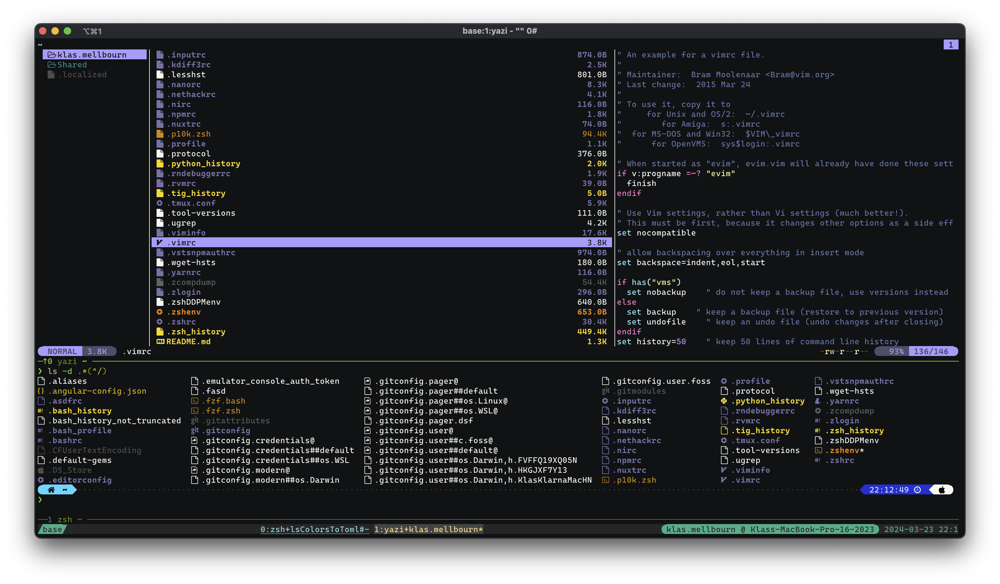

# LS_COLORS yazi-theme

[LS_COLORS by trapd00r](https://github.com/trapd00r/LS_COLORS) contains unique colors from over 300 different file types. This is typically used by ls (or ls-like commands like [lsd](https://github.com/lsd-rs/lsd)) to color files in the terminal.

This repository contains a [yazi](https://github.com/sxyazi/yazi) [theme](https://github.com/yazi-rs/flavors) that uses the colors from LS_COLORS. The colors were converted using [lsColorsToToml](https://github.com/Mellbourn/lsColorsToToml)

## Install

```sh
git clone https://github.com/Mellbourn/ls-colors.yazi
mkdir -p ~/.config/yazi
cd ls-colors.yazi
mv theme.toml ~/.config/yazi/
```

Alternatively, you can simply insert the contents of `theme.toml` into your `~/.config/yazi/theme.toml` file, replacing or extending the `[filetype±]` section.

## Screenshot

Screenshot (in [tmux](https://github.com/tmux/tmux/wiki)) showing [yazi](https://github.com/sxyazi/yazi) in the top pane and an [lsd](https://github.com/lsd-rs/lsd) list below. Notice that the colors of the files match.

